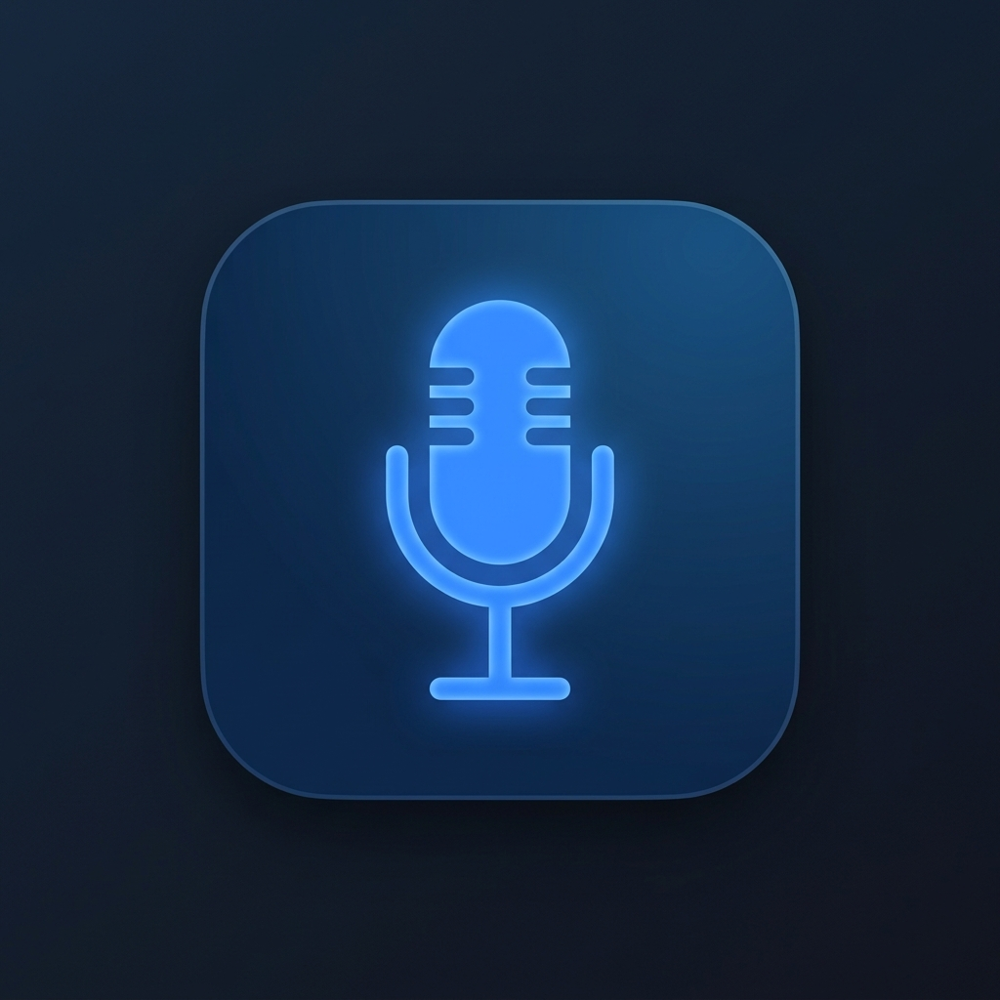
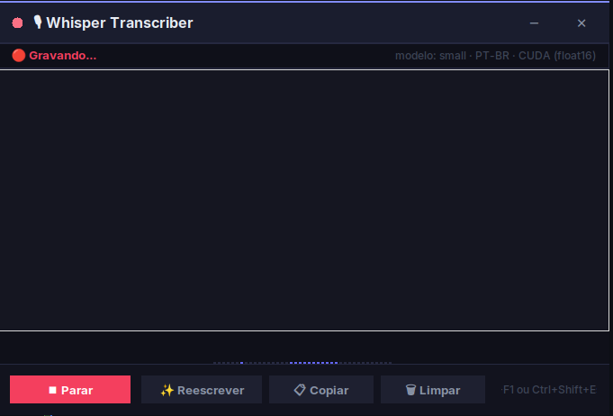

<a id="readme-top"></a>

<!-- PROJECT LOGO -->
<br />
<div align="center">
  <a href="https://github.com/alissonpef/Whisper-Transcriber">
    
  </a>

  <h3 align="center">Transcritor Whisper</h3>

  <p align="center">
    Uma ferramenta poderosa e elegante para transcrição de áudio local com refinamento por IA.
    <br />
    <a href="#uso"><strong>Explorar funcionalidades »</strong></a>
    <br />
    <br />
    <a href="#demonstração">Ver Demo</a>
    &middot;
    <a href="https://github.com/alissonpef/Whisper-Transcriber/issues">Reportar Bug</a>
    &middot;
    <a href="https://github.com/alissonpef/Whisper-Transcriber/issues">Sugerir Recurso</a>
  </p>
</div>

<!-- TABLE OF CONTENTS -->
<details>
  <summary>Sumário</summary>
  <ol>
    <li>
      <a href="#sobre-o-projeto">Sobre o Projeto</a>
      <ul>
        <li><a href="#tecnologias-utilizadas">Tecnologias Utilizadas</a></li>
      </ul>
    </li>
    <li>
      <a href="#primeiros-passos">Primeiros Passos</a>
      <ul>
        <li><a href="#pré-requisitos">Pré-requisitos</a></li>
        <li><a href="#instalação">Instalação</a></li>
      </ul>
    </li>
    <li><a href="#uso">Como Usar</a></li>
    <li><a href="#roadmap">Roadmap</a></li>
    <li><a href="#licença">Licença</a></li>
    <li><a href="#contato">Contato</a></li>
  </ol>
</details>

<!-- ABOUT THE PROJECT -->
## Sobre o Projeto

<div align="center">
  
</div>

O **Transcritor Whisper** é uma aplicação desktop desenvolvida para transformar sua voz em texto de forma instantânea e privada. Utilizando modelos de última geração rodando localmente, ele garante que seus dados nunca saiam da sua máquina.

### Principais Características:
* **Privacidade Total:** Processamento 100% local (Whisper + LLM Local).
* **Refinamento por IA:** Botão "Reescrever" que utiliza um modelo Qwen para limpar gaguejos, vícios de linguagem e melhorar a coesão do texto.
* **Agilidade:** Atalho global (`Ctrl+Shift+Espaço`) para iniciar/parar gravações de qualquer lugar.
* **Interface Moderna:** Design escuro e minimalista com animações fluidas e visualização de ondas sonoras em tempo real.
* **Resiliência:** Suporte a aceleração por hardware (CUDA) com fallback automático para CPU.

<p align="right">(<a href="#readme-top">voltar ao topo</a>)</p>

### Tecnologias Utilizadas

O projeto utiliza o que há de mais moderno em IA local e desenvolvimento Python:

* [![Python][Python-shield]][Python-url]
* [![Faster-Whisper][Whisper-shield]][Whisper-url]
* [![Llama.cpp][Llama-shield]][Llama-url]
* [![Tkinter][Tkinter-shield]][Tkinter-url]

<p align="right">(<a href="#readme-top">voltar ao topo</a>)</p>

<!-- GETTING STARTED -->
## Primeiros Passos

Para configurar o Transcritor localmente, siga estes passos simples.

### Pré-requisitos

O projeto foi desenvolvido para Linux (especialmente distros baseadas em Debian/Ubuntu).
* **Python 3.10** ou superior
* **FFmpeg** (para processamento de áudio)
* **PortAudio** (para captura de microfone)

### Instalação

1. Clone o repositório
   ```sh
   git clone https://github.com/alissonpef/Whisper-Transcriber.git
   ```
2. Entre na pasta do projeto
   ```sh
   cd Transcritor
   ```
3. Execute o script de instalação automática
   ```sh
   ./scripts/install.sh
   ```
   *O script irá configurar o ambiente virtual, instalar dependências e configurar os atalhos do sistema.*

<p align="right">(<a href="#readme-top">voltar ao topo</a>)</p>

<!-- USAGE EXAMPLES -->
## Como Usar

1. **Início Automático:** O daemon de hotkey inicia junto com o sistema.
2. **Gravação:** Pressione `Ctrl+Shift+Espaço` para abrir a popup e começar a gravar.
3. **Transcrição:** O texto aparecerá em tempo real. Pressione o atalho novamente para parar.
4. **Magia da IA:** Clique em **✨ Reescrever** para que a IA local transforme sua transcrição bruta em um texto profissional e fluido.
5. **Copiar:** Use o botão de copiar ou `Ctrl+Shift+C` para levar o texto para sua área de transferência.

<p align="right">(<a href="#readme-top">voltar ao topo</a>)</p>

<!-- ROADMAP -->
## Roadmap

- [x] Suporte a Wayland e X11
- [x] Integração com LLM Local (Qwen 1.5B)
- [x] Ícone na bandeja do sistema (Tray Icon)
- [ ] Suporte a múltiplos idiomas na interface
- [ ] Exportação direta para arquivos .txt ou .md
- [ ] Histórico de transcrições recentes

Veja as [issues abertas](https://github.com/alissonpef/Whisper-Transcriber/issues) para uma lista completa de recursos propostos.

<p align="right">(<a href="#readme-top">voltar ao topo</a>)</p>

<!-- CONTACT -->
## Contato

Alisson - [Gmail](alissonpef@gmail.com)

Link do Projeto: [https://github.com/alissonpef/Whisper-Transcriber](https://github.com/alissonpef/Whisper-Transcriber)

<p align="right">(<a href="#readme-top">voltar ao topo</a>)</p>

<!-- MARKDOWN LINKS & IMAGES -->
[Python-shield]: https://img.shields.io/badge/Python-3776AB?style=for-the-badge&logo=python&logoColor=white
[Python-url]: https://www.python.org/
[Whisper-shield]: https://img.shields.io/badge/Faster--Whisper-OpenAI-blue?style=for-the-badge
[Whisper-url]: https://github.com/SYSTRAN/faster-whisper
[Llama-shield]: https://img.shields.io/badge/Llama--CPP-AI-green?style=for-the-badge
[Llama-url]: https://github.com/abetlen/llama-cpp-python
[Tkinter-shield]: https://img.shields.io/badge/Tkinter-GUI-orange?style=for-the-badge
[Tkinter-url]: https://docs.python.org/3/library/tkinter.html